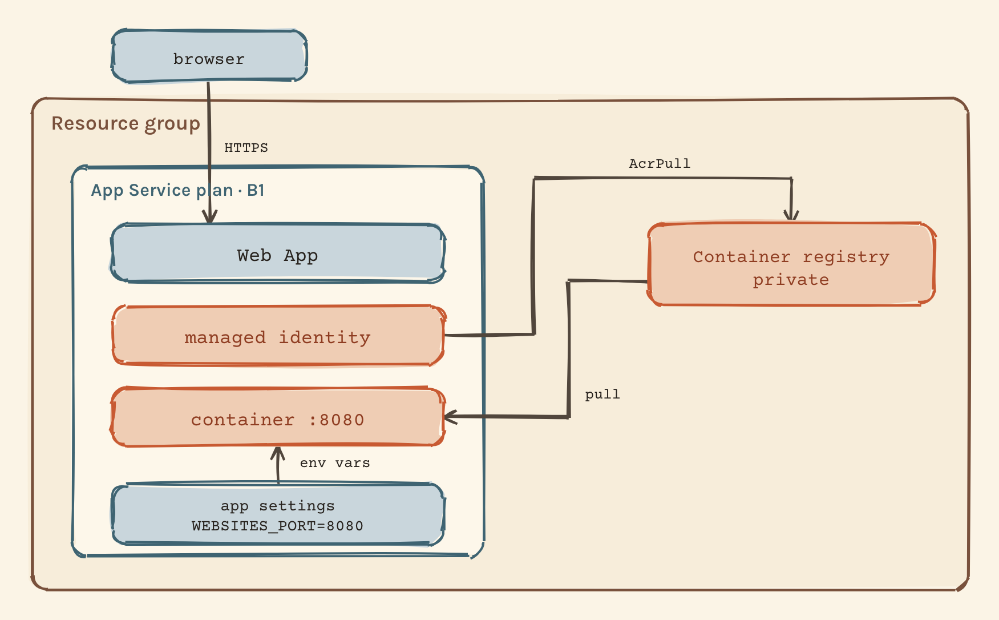

# Pull a private image into App Service with a managed identity

Deploying a container to App Service looks like one step until the first pull fails. Then you find out that three separate things have to line up: the registry has to trust an identity, the Web App has to own that identity, and App Service has to be told to use it instead of looking for a username and password. Miss any one of them and you get the same unhelpful "Application Error" page.

This lab builds that path once, on purpose, from an empty resource group. It runs a small FastAPI service in a private Azure Container Registry, pulls it into a Linux Web App with a system-assigned managed identity, feeds it configuration through application settings, and then breaks the port on purpose so you can read what a real failure looks like in the container log.

Nothing here is automated. There is no script that runs the lab for you, because the value is in running each command yourself and being able to say what its success proved.

## What this lab actually teaches

By the end you should be able to answer these without looking them up:

- Which identity performs the image pull, and where that identity lives.
- Why `AcrPull` on the registry beats turning on the registry admin user.
- What an App Service application setting gives you that an environment variable baked into the image does not.
- Why a container can start correctly and still leave the site returning an error.
- How to tell an image-pull failure apart from a port mismatch by reading the log instead of guessing.

## How it maps to AI-200

The AI-200 skills outline names "deploy containers to Azure App Service, including configuring App Service to supply environment variables and secrets" under the containerized solutions area, which carries 20 to 25 percent of the exam. This lab covers that bullet directly.

It deliberately leaves out sidecar containers. Sidecars are part of the official learning path but they are a second model with their own configuration surface, and mixing the two is how people end up setting `WEBSITES_PORT` on a sidecar app and wondering why it does nothing. This lab stays on the classic single-container model throughout.

## The four moving parts

**Azure Container Registry** stores the image privately. Nothing anonymous can pull from it. It also builds the image for you through ACR Tasks, so the build happens in Azure and you never need a local Docker daemon for the Azure part.

**App Service plan** is the compute you rent. It is a Linux plan here because Linux custom containers need one. The plan is what you pay for by the hour, and it keeps charging whether or not an app inside it is running.

**Web App** is the application that sits on the plan. It holds the image reference, the application settings, and the identity.

**System-assigned managed identity** is a service principal whose lifecycle is tied to the Web App. Azure creates it, rotates its credentials, and deletes it with the app. You never see a secret for it. Granting that identity `AcrPull` on the registry is what replaces the registry username and password.

The sequence that matters: the identity has to exist before you can grant it a role, the role has to exist before the pull can succeed, and App Service has to be told to use managed identity at all, which is a separate site setting from having the identity.



The two arrows on the right are doing different jobs, and that is the part worth slowing down on. `AcrPull` is a grant you make once, scoped to the registry rather than to the resource group. The pull is the runtime path that uses it, and it only happens because `acrUseManagedIdentityCreds` is set on the Web App, which is a third thing that the drawing cannot show you. Editable source: `img/managed-identity-pull.excalidraw`.

## The application

A four-endpoint FastAPI service in `main.py`. It is small on purpose, so that when something breaks you know it is the platform and not your code.

| Endpoint | Returns |
|---|---|
| `GET /` | The application name and the version it was configured with |
| `GET /health/live` | `{"status": "live"}` |
| `GET /health/ready` | `{"status": "ready"}` |
| `GET /config` | Whether `EXTERNAL_API_KEY` is set, as a boolean |

`/config` returns `true` or `false` and never the value. That is the whole point of it: you can prove a secret reached the container without putting the secret in a screenshot, a log, or your shell history.

Be clear about what the two health endpoints prove in this lab. Both return 200 unconditionally, so they prove the process is up and routing works. Neither checks a downstream dependency, because this app has none. A readiness endpoint earns its name when it fails while the process is still alive, and that only happens once something real sits behind it.

`APP_VERSION` does more than it looks like it does. Set it to the same string as the image tag and `GET /` becomes your proof that the container currently serving traffic came from the tag you think it did.

## Prerequisites

- An Azure subscription on a paid plan. **ACR Tasks runs are currently paused for Azure free credits**, and the Microsoft Learning exercise pages say so directly: "Azure Container Registry task runs are temporarily paused from Azure free credits. This exercise requires a Pay-As-You-Go, or another paid plan." If you are on free credits, the `az acr build` step will fail and the rest of the lab cannot proceed.
- Azure CLI, signed in with `az login`. The commands below were checked against Azure CLI 2.90.0.
- Permission to create a resource group and to create role assignments in the subscription. Granting `AcrPull` needs `Microsoft.Authorization/roleAssignments/write`, which Contributor alone does not include. Owner or User Access Administrator does.
- Docker, only if you want to run the app locally first. The Azure path does not need it.
- `zsh`. The commands use zsh syntax and quoting.

## Run it locally first

Do this first. If the container works on your machine, every later failure is an Azure configuration problem, and that narrows the search a lot.

Build it:

```zsh
docker build -t appservice-config-api:local .
```

Run it with configuration supplied from outside the image, the same way App Service will supply it:

```zsh
cp .env.example .env
docker run --rm -p 8080:8080 --env-file .env appservice-config-api:local
```

In a second terminal:

```zsh
curl http://localhost:8080/
curl http://localhost:8080/health/live
curl http://localhost:8080/health/ready
curl http://localhost:8080/config
```

You should see `"version":"local"` from `/` and `"external_api_key_configured":true` from `/config`. Now stop the container, run it again without `--env-file`, and call `/config` once more. It flips to `false`, and `/` reports `"unknown"`. The Azure half of this lab depends on exactly that behaviour: the image is the same, the configuration is not in it, and the platform supplies it.

Confirm the container is not running as root:

```zsh
docker run --rm appservice-config-api:local whoami
```

It prints `appuser`.

## The Azure walkthrough

Every command below runs on your machine. What differs is where the work happens: most of these send a request to the Azure control plane and return when Azure has accepted it, while `az acr build` uploads your source to Azure and the build itself runs there.

Run them one block at a time and read the output before moving on.

### 1. Set your variables

```zsh
export LAB_LOCATION="northeurope"
export LAB_RG="ai200-appservice-lab-rg"
export LAB_SUFFIX="$(openssl rand -hex 3)"
export LAB_ACR="ai200acr${LAB_SUFFIX}"
export LAB_PLAN="ai200-appservice-plan"
export LAB_WEBAPP="ai200-appservice-${LAB_SUFFIX}"
export LAB_IMAGE="appservice-config-api"
export LAB_TAG="v1"

echo "suffix: $LAB_SUFFIX"
echo "registry: $LAB_ACR"
echo "web app: $LAB_WEBAPP"
```

Registry names and Web App names are globally unique across all of Azure, which is why they get a random suffix. Write the printed suffix down. If you close this terminal you need to re-run this block with the *same* suffix, or the later commands will point at resources that do not exist.

Nothing has been created yet. This block only sets shell variables.

### 2. Create the dedicated resource group

```zsh
az group create \
  --name "$LAB_RG" \
  --location "$LAB_LOCATION" \
  --output table
```

Everything in this lab goes in this one group, and the cleanup at the end deletes exactly this group. That is the whole reason for a dedicated group: it makes cleanup a single reversible decision instead of a hunt through the portal.

Success proves the group exists and your account can create resources in the subscription.

### 3. Create the registry with admin credentials disabled

```zsh
az acr create \
  --resource-group "$LAB_RG" \
  --name "$LAB_ACR" \
  --sku Basic \
  --admin-enabled false \
  --output table
```

`--admin-enabled false` is the point of the exercise. The admin user is a single shared username and password for the whole registry, it cannot be scoped to one repository, and it does not tell you who pulled what. Turning it off forces the managed identity path that the rest of the lab builds.

Basic is the cheapest tier and includes 10 GB of storage, far more than this image needs.

Check what you got:

```zsh
az acr show \
  --resource-group "$LAB_RG" \
  --name "$LAB_ACR" \
  --query "{name:name, sku:sku.name, adminUserEnabled:adminUserEnabled, loginServer:loginServer}" \
  --output table
```

Success proves the registry exists and `adminUserEnabled` is `False`. From here there is no password to accidentally paste anywhere.

### 4. Build the image with ACR Tasks

Run this from the repository root, where the `Dockerfile` is:

```zsh
az acr build \
  --registry "$LAB_ACR" \
  --resource-group "$LAB_RG" \
  --image "${LAB_IMAGE}:${LAB_TAG}" \
  --file Dockerfile \
  .
```

The trailing `.` is the build context. The CLI packs it up, uploads it, and Azure runs the build on its own agent. You get the build log streamed back, but no Docker daemon runs on your machine and the resulting image is pushed straight into the private registry without a `docker push`.

Confirm the tag landed:

```zsh
az acr repository show-tags \
  --name "$LAB_ACR" \
  --repository "$LAB_IMAGE" \
  --output table
```

Success proves the image exists in the registry under a tag you can name. That tag is what you will reference from App Service and what `APP_VERSION` will echo back to you at runtime.

### 5. Create the Linux App Service plan

```zsh
az appservice plan create \
  --resource-group "$LAB_RG" \
  --name "$LAB_PLAN" \
  --is-linux \
  --sku B1 \
  --output table
```

B1 is the cheapest SKU with dedicated compute, which is what a custom container wants. The Free and Shared tiers run on shared instances with CPU quotas that make container behaviour hard to reason about, and a lab where you cannot trust the symptoms is not worth running.

Success proves you have compute to put an app on. Note that billing for the plan starts here, not when the app first serves a request.

### 6. Create the Web App pointing at the private image

```zsh
az webapp create \
  --resource-group "$LAB_RG" \
  --plan "$LAB_PLAN" \
  --name "$LAB_WEBAPP" \
  --container-image-name "${LAB_ACR}.azurecr.io/${LAB_IMAGE}:${LAB_TAG}" \
  --output table
```

`--container-image-name` is the current flag. You will still see `--deployment-container-image-name` in older material; the CLI accepts it and prints a deprecation warning.

**Expect the site not to work yet.** You have pointed a Web App at a private registry without giving it any way to authenticate. The app resource exists, the image reference is stored, and the pull fails. Do not test the URL here and do not treat an error as a problem to debug: steps 7 through 10 are the fix, and testing before them just teaches you to distrust a working setup.

Success proves the app resource exists with the image reference recorded.

### 7. Give the Web App a system-assigned managed identity

```zsh
WEBAPP_PRINCIPAL_ID="$(az webapp identity assign \
  --resource-group "$LAB_RG" \
  --name "$LAB_WEBAPP" \
  --query principalId \
  --output tsv)"

echo "principal id: $WEBAPP_PRINCIPAL_ID"
```

This creates a service principal in Microsoft Entra ID whose lifetime is bound to the Web App. Azure manages its credentials and you never handle one. Delete the Web App and the identity goes with it.

Success proves the app now has an identity to be granted things. It has been granted nothing yet.

### 8. Grant that identity AcrPull on the registry

Get the registry's resource ID, which is the scope of the grant:

```zsh
ACR_RESOURCE_ID="$(az acr show \
  --resource-group "$LAB_RG" \
  --name "$LAB_ACR" \
  --query id \
  --output tsv)"

echo "acr id: $ACR_RESOURCE_ID"
```

Then assign the role:

```zsh
az role assignment create \
  --assignee "$WEBAPP_PRINCIPAL_ID" \
  --scope "$ACR_RESOURCE_ID" \
  --role AcrPull \
  --output table
```

Read the scope carefully. It is the registry, not the resource group and not the subscription. `AcrPull` gives read access to images and nothing else: this identity cannot push, cannot delete a tag, and cannot touch any other resource in the group.

If that command fails complaining that it cannot find the principal, the identity was created seconds ago and directory replication has not caught up. Wait a minute, or skip the lookup entirely:

```zsh
az role assignment create \
  --assignee-object-id "$WEBAPP_PRINCIPAL_ID" \
  --assignee-principal-type ServicePrincipal \
  --scope "$ACR_RESOURCE_ID" \
  --role AcrPull \
  --output table
```

Success proves the registry will now answer a pull from this specific identity. It does not yet mean App Service will try.

### 9. Tell App Service to pull with that identity

```zsh
az webapp config set \
  --resource-group "$LAB_RG" \
  --name "$LAB_WEBAPP" \
  --generic-configurations '{"acrUseManagedIdentityCreds": true}' \
  --output table
```

This is the step people skip, and it is the reason "I granted AcrPull and it still fails" is such a common question. Having an identity with the right role is not the same as App Service deciding to use it. Without this site setting the platform keeps looking for `DOCKER_REGISTRY_SERVER_USERNAME` and `DOCKER_REGISTRY_SERVER_PASSWORD`, finds nothing useful, and fails the pull.

Success proves the pull path is now identity-based end to end: the app owns an identity, the identity can read the registry, and the platform has been told to use it.

One registry setting can break this even when everything above is correct. App Service image pulls rely on ARM-scoped Entra tokens, and a registry can be configured to reject them. New registries accept them by default, so the one you just created is fine, but you should know the check exists:

```zsh
az acr config authentication-as-arm show --registry "$LAB_ACR"
```

`status: enabled` is what the pull needs. If a registry has it disabled, pulls fail with an `UNAUTHORIZED` token validation error that looks exactly like a missing role assignment.

### 10. Configure the port and the application settings

```zsh
az webapp config appsettings set \
  --resource-group "$LAB_RG" \
  --name "$LAB_WEBAPP" \
  --settings \
    WEBSITES_PORT=8080 \
    APP_VERSION="$LAB_TAG" \
    EXTERNAL_API_KEY="placeholder-not-a-real-key" \
  --output table
```

Three settings doing three different jobs.

`WEBSITES_PORT` is not read by your application. It tells the App Service platform which port to send its HTTP health ping and its traffic to. App Service assumes port 80 by default; this container listens on 8080, so the platform has to be told. It can only forward to one port.

`APP_VERSION` is read by the application and returned from `GET /`. This is your proof of which image is live.

`EXTERNAL_API_KEY` is a stand-in for a real secret, and it exists here to practise the mechanism, not to protect anything. **Use exactly this placeholder or another obviously fake value.** Anything you type into this command lands in your shell history and in the App Service configuration blade in plain text. A real secret belongs in Key Vault with a Key Vault reference, which is a different lab.

The application settings are injected into the container as environment variables at start time, which is what lets the same image run in every environment while the environment supplies what differs between them. Bake `EXTERNAL_API_KEY` into the Dockerfile instead and you have shipped a secret to everyone who can pull the image.

Changing an application setting restarts the app automatically.

### 11. Turn on container logging

Do this before the first verification, so that if something is wrong you already have the log.

```zsh
az webapp log config \
  --resource-group "$LAB_RG" \
  --name "$LAB_WEBAPP" \
  --docker-container-logging filesystem \
  --output table
```

Success proves the platform will now write container stdout and stderr where you can read it.

### 12. Restart and verify

```zsh
az webapp restart \
  --resource-group "$LAB_RG" \
  --name "$LAB_WEBAPP"
```

Give it a minute. The first start pulls every image layer, and a cold pull is slower than the restarts that follow.

```zsh
curl -s "https://${LAB_WEBAPP}.azurewebsites.net/"
curl -s "https://${LAB_WEBAPP}.azurewebsites.net/health/live"
curl -s "https://${LAB_WEBAPP}.azurewebsites.net/health/ready"
curl -s "https://${LAB_WEBAPP}.azurewebsites.net/config"
```

### What each response actually proves

| Response | What it proves | What it does not prove |
|---|---|---|
| `GET /` returns `{"application":"appservice-config-api","version":"v1"}` | The private pull worked, the container started, App Service routed traffic to the right port, and the live container came from the `v1` tag | Nothing about whether the rest of your configuration is correct |
| `GET /health/live` returns 200 | The process is running and answering HTTP | Nothing about dependencies, since this endpoint checks none |
| `GET /health/ready` returns 200 | The same as above, in this lab | That the app would refuse traffic when unhealthy, because nothing here can make it fail |
| `GET /config` returns `{"external_api_key_configured":true}` | The application setting reached the container as an environment variable | That the value is correct, only that something non-empty is set |

If `/` reports `"version":"unknown"`, the container is running an image that never received `APP_VERSION`, which usually means you are looking at a container that started before step 10 and has not been replaced yet. Restart and check again.

Those four responses together are the healthy deployment. Do not move on until you have them, because the troubleshooting section only teaches you something if you know what you are breaking.

## Troubleshooting: break the port on purpose

The single most common custom container failure on App Service is a port mismatch, and it produces a page that says almost nothing. The fastest way to learn to recognise it is to cause it while you already know the answer.

### Break it

```zsh
az webapp config appsettings set \
  --resource-group "$LAB_RG" \
  --name "$LAB_WEBAPP" \
  --settings WEBSITES_PORT=8000 \
  --output table
```

The container still listens on 8080, because that is compiled into the image's `CMD`. The platform now probes 8000, where nothing is listening.

### Watch it fail

```zsh
az webapp log tail \
  --resource-group "$LAB_RG" \
  --name "$LAB_WEBAPP"
```

This streams the container log to your terminal. Leave it running for a few minutes and stop it with `Ctrl+C`. In another terminal, ask for the site:

```zsh
curl -i "https://${LAB_WEBAPP}.azurewebsites.net/"
```

You get an error page, typically a 503, with no useful detail. The browser has nothing to tell you, which is what makes this failure annoying: it is invisible from the outside and obvious from the inside.

### Read the log

In the stream you should see the application start normally, with uvicorn reporting that it is listening on `0.0.0.0:8080`, followed by a platform line similar to:

```
Container appservice-config-api_0_xxxxxxxx didn't respond to HTTP pings on port: 8000,
failing site start. See container logs for debugging.
```

Read the two halves together. The application half says the process started and bound a port successfully, and the platform half says the platform gave up waiting on a different port. Nothing crashed, and nothing inside the container is misconfigured.

Keep that shape in your head. When the container log shows a clean startup and the platform still fails the site, the problem sits between them rather than inside either one, and the port is the first thing to check.

Compare that with the other failure this lab could have produced. An image-pull failure never gets as far as an application log, because there is no container to log anything. You see the platform reporting an unauthorised or not-found pull and nothing from your app at all. Whether you have application output is the first fork in the diagnosis.

### Fix it

```zsh
az webapp config appsettings set \
  --resource-group "$LAB_RG" \
  --name "$LAB_WEBAPP" \
  --settings WEBSITES_PORT=8080 \
  --output table
```

```zsh
az webapp restart \
  --resource-group "$LAB_RG" \
  --name "$LAB_WEBAPP"
```

Wait a minute, then confirm you are back:

```zsh
curl -s "https://${LAB_WEBAPP}.azurewebsites.net/"
curl -s "https://${LAB_WEBAPP}.azurewebsites.net/config"
```

Restoring the setting and getting 200 again proves the port was the only thing wrong. Say that out loud when you see it, because a fix that works is not the same as a diagnosis that was right, and the only reason you can claim the second one here is that you changed exactly one thing.

## What this costs

Rates below come from the [Azure Retail Prices API](https://learn.microsoft.com/en-us/rest/api/cost-management/retail-prices/azure-retail-prices), checked on 17 September 2026 for North Europe, West Europe and France Central, which all listed the same figures for these meters. Treat them as an order of magnitude, not a quote: prices change, they differ by region and currency, and your own bill depends on your agreement and any credits. The [pricing calculator](https://azure.microsoft.com/en-us/pricing/calculator/) is the place to check yours.

| What | Listed rate | Billed |
|---|---|---|
| App Service plan, Basic B1, Linux | 0.018 USD per hour | Per hour the plan exists, running or not |
| Container Registry, Basic | 0.1666 USD per day | Per day, includes 10 GB storage |
| ACR Tasks build | First 6,000 vCPU-seconds per month free, then 0.0001 USD per vCPU-second | Per second of build time |

Look at the shape rather than the numbers. The build is effectively free at this size, the registry costs cents per day, and the plan is the meter that runs continuously whether you are using it or not. An afternoon of lab work at those rates comes to a fraction of a dollar, while leaving the plan up for a month is what turns it into real money. That is the argument for deleting the resource group when you finish instead of tidying up later.

Billing data lags roughly 8 to 24 hours, so checking Cost Management right after the lab will show you less than you spent. Check the next day if you want the real number.

## Cleanup

One command, because everything lives in one dedicated group:

```zsh
az group delete \
  --name "$LAB_RG" \
  --yes
```

This deletes the Web App, the App Service plan, the registry with the image in it, the system-assigned identity, and the `AcrPull` role assignment scoped to the registry. Deleting a resource group is not reversible.

Confirm it is gone rather than assuming:

```zsh
az group exists --name "$LAB_RG"
```

It prints `false` once the group is gone. If it prints `true`, the delete is still running, since it is asynchronous and can take several minutes.

One thing the group delete does not cover: role assignments scoped outside the group. This lab scopes `AcrPull` to the registry, which is inside the group, so it goes with it. If you experimented with a subscription-scoped or resource-group-scoped assignment, list and remove that separately.

## Evidence checklist

Nothing below has been run yet. This repository is the material for the lab, and the record of running it is yours to fill in. Tick these off as you go and keep the outputs.

- [ ] Local `docker build` succeeded and the container answered all four endpoints
- [ ] `docker run --rm appservice-config-api:local whoami` printed `appuser`
- [ ] `az acr show` reported `adminUserEnabled: False`
- [ ] `az acr build` succeeded and `az acr repository show-tags` listed the tag
- [ ] `az webapp identity assign` returned a principal ID
- [ ] `az role assignment create` succeeded with the registry resource ID as the scope
- [ ] `az webapp config set` applied `acrUseManagedIdentityCreds`
- [ ] `GET /` returned the image tag in the `version` field
- [ ] `GET /config` returned `external_api_key_configured: true` and no value
- [ ] The broken-port run produced a container log showing a clean app start and a platform ping failure on 8000
- [ ] Restoring `WEBSITES_PORT=8080` returned the site to 200
- [ ] `az group exists` returned `false` after cleanup

Once you have run these, write a sentence answering one question: which identity pulled the image, and how do you know. An exam scenario will ask you that sideways.

## References

- [AI-200 study guide](https://learn.microsoft.com/en-us/credentials/certifications/resources/study-guides/ai-200)
- [Configure a custom container for Azure App Service](https://learn.microsoft.com/en-us/azure/app-service/configure-custom-container?pivots=container-linux)
- [Use managed identity to pull an image from Azure Container Registry](https://learn.microsoft.com/en-us/azure/app-service/configure-custom-container?pivots=container-linux#use-managed-identity-to-pull-an-image-from-azure-container-registry)
- [Managed identities in App Service](https://learn.microsoft.com/en-us/azure/app-service/overview-managed-identity)
- [Configure registry acceptance of Microsoft Entra authentication scopes](https://learn.microsoft.com/en-us/azure/container-registry/container-registry-disable-authentication-as-arm)
- [az webapp CLI reference](https://learn.microsoft.com/en-us/cli/azure/webapp)
- [az acr CLI reference](https://learn.microsoft.com/en-us/cli/azure/acr)
- [App Service for Linux pricing](https://azure.microsoft.com/en-us/pricing/details/app-service/linux/)
- [Container Registry pricing](https://azure.microsoft.com/en-us/pricing/details/container-registry/)
